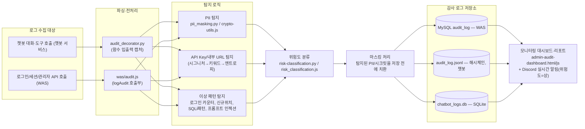

# 1. 보안 위협 모델링 및 탐지 설계서

## ① 프로젝트 개요

**프로젝트 주제**
미소병원 3-Tier 애플리케이션(WAS+챗봇+MySQL)의 감사 로그 위험 탐지·마스킹 시스템

**해결하고자 하는 문제**
로그인/챗봇 대화 로그에 개인정보·내부 시크릿이 마스킹 없이 그대로 남을 수 있고, 관리자
계정을 노린 이상행위나 챗봇 프롬프트 인젝션 같은 위험 신호가 정상 로그 사이에 묻혀
발견되지 않는 문제.

**탐지 대상**
- 개인정보(PII): 이름, 전화번호, 이메일, 주민등록번호
- 내부 정보: 내부 URL/사설 IP, API Key·시크릿 문자열
- 이상 패턴: 로그인 반복 실패, 동일 IP 고빈도 시도, 비정상 입력 길이, SQL 인젝션 서명,
  관리자 계정의 신규 IP/지역 로그인, 챗봇 프롬프트 인젝션 시도 및 시스템 프롬프트 유출

**사용한 탐지 방식**
- 정규식 기반 1차 탐지(주민번호/전화번호/이메일, 성씨 화이트리스트+문맥 규칙) + spaCy NER
  기반 2차 보완(트리거 단어 없는 이름까지 탐지)
- 시크릿 탐지는 알려진 시그니처 → 키워드+값 패턴 → Shannon 엔트로피 기반 폴백까지 단계적
  적용
- 로그인 이상행위는 계정별/IP별 시간창 카운터, 관리자 신규 위치는 DB에 누적된 이력과 대조
- 프롬프트 인젝션은 키워드 매칭(시도 탐지) + 응답 내 시스템 지시문 원문 존재 여부의
  결정론적 검사(유출 확정) 이중 구조

**주요 사용자 / 사용 시나리오**
- **관리자**: 감사 대시보드에서 위험도별 탐지 현황을 확인하고, 고위험 IP를 즉시 수동
  차단한다. Discord로 고위험 이벤트를 실시간으로 받는다.
- **환자(일반 사용자)**: 별도 조작 없이 본인이 남긴 로그(챗봇 대화, 로그인 기록)가 자동으로
  마스킹·암호화되어 보호받는 대상이다.
- **원무(staff)**: RBAC 권한이 admin보다 낮아, 진료기록을 조회하면 원문이 아니라 역할
  기반으로 마스킹된 값(진단명 앞 2글자+`***`, 치료내용 `***`)만 본다 — 탐지 결과에 따른
  마스킹이 아니라 **역할에 따라 항상 적용되는 마스킹**이라는 점에서 환자·관리자와는 다른
  방식으로 마스킹 시스템과 관련된 사용자다.
- **탐지 파이프라인 자체**: 사람 개입 없이 매 요청마다 자동으로 마스킹·위험도 분류·감사
  기록을 수행한다.

## ② 전체 아키텍처



**예시 흐름**: 로그 발생 → 수집·전처리 → 탐지 로직 → 위험도 분류 → 마스킹 →
감사 로그 저장 → 모니터링 대시보드 반영, 위험도가 "상"이면 별도로 Discord 리포트 발송.

## ③ 탐지 흐름 설명

1. 로그인 요청이나 챗봇 대화 요청이 들어오면, WAS의 `logAudit()` 또는 챗봇의
   `@audit_log` 데코레이터가 그 요청의 입력값(질문, 아이디, IP, 경로 등)을 수집한다.
2. 수집된 값은 곧바로 저장되지 않고 먼저 마스킹 모듈(`pii_masking.py`/`crypto-utils.js`)을
   거친다 — 이름/전화번호/이메일/주민번호와 내부 URL/API Key를 탐지해 치환한다.
3. 같은 시점에 이상 패턴 탐지 로직이 함께 동작한다 — 로그인이면 계정별/IP별 시도 횟수와
   입력 길이·SQLi 서명을 확인하고, 챗봇 요청이면 인젝션 키워드와 시스템 프롬프트 유출
   여부를 확인한다.
4. 탐지된 신호(관리자 계정 관련, 악의적 의도 확정 등)에 따라 위험도(상/중/하)를 분류한다.
   판정은 이 시점에 확정되어 이후 재분류되지 않는다.
5. 마스킹이 끝난 값과 확정된 위험도를 감사 로그 저장소(WAS는 MySQL `audit_log`, 챗봇은
   해시체인이 적용된 JSONL)에 기록한다.
6. 위험도가 "상"이면 Discord로 실시간 리포트가 즉시 발송된다. 관리자가 모니터링
   대시보드를 열면 저장소 3곳(WAS MySQL, 챗봇 JSONL, 챗봇 SQLite)의 최신 상태가 하나의
   화면(위험도 요약/주요 탐지 내역/전체 이력/PII 스캔 현황)으로 통합되어 보인다.

## ④ 주요 설계 결정

- **어떤 개인정보 유형을 탐지 대상으로 선정했는가**: 실제로 시스템에 존재하는 개인정보
  필드(이름, 전화번호, 이메일, 주민등록번호)만을 대상으로 했다 — 존재하지 않는 정보 유형을
  탐지하는 것은 의미가 없기 때문이다.
- **규칙 기반과 모델 기반 탐지를 어떻게 조합했는가**: 정규식·화이트리스트 같은 규칙 기반
  탐지를 1차로 두고, spaCy NER을 2차 보완으로 붙였다. 규칙 기반은 빠르고 오탐 원인을
  바로 알 수 있지만 트리거 단어가 없는 이름은 놓친다 — NER이 그 사각지대를 메운다. 반대로
  NER만 쓰면 모델 로드 실패 시 전부 놓칠 수 있어, 규칙 기반을 항상 먼저 적용해 최소한의
  탐지력을 보장한다.
- **위험도 등급을 어떻게 분류했는가**: 상(관리자 계정을 노린 정황·악의적 의도 확정),
  중(자동화 공격 가능성·권한 상승 동반 조작), 하(정상 흐름) 세 단계로 나누고, 매핑에 없는
  새 이벤트는 안전한 쪽으로 실패하도록 "중"을 기본값으로 둔다. 등급은 탐지 시점에 확정해
  저장하고 이후 재분류하지 않는다 — "그때 이 이벤트를 얼마나 심각하게 봤는가"라는 감사
  기록 본연의 목적을 지키기 위함이다.
- **마스킹 방식(치환/삭제/해시)을 어떻게 선택했는가**: 사람이 읽는 감사 로그이므로 완전
  삭제 대신 **부분 치환**(`admin`→`adm**`, 전화번호 가운데자리 `****`)을 기본으로 했다 —
  값이 완전히 사라지면 침해 조사에 필요한 최소한의 식별력도 잃기 때문이다. 반면 비밀번호는
  이미 해시로만 저장되어 마스킹 자체가 불필요하고, 주민등록번호는 감사 로그가 아니라
  원본 데이터 자체를 AES-256-GCM으로 암호화해 저장한다(마스킹이 아니라 암호화를 택한
  이유는 본인 조회 시 복호화가 필요하기 때문).
- **감사 로그에 어떤 정보를 남길지**: 행위자(계정), 시각, 액션, IP, 경로, 위험도, 마스킹된
  상세 정보를 남긴다. IP는 마스킹하지 않는다 — 침해 대응에 대체 불가능한 값이고 로그 열람
  자체가 관리자 전용으로 통제되기 때문이다. 반대로 비밀번호 값은 길이 외에는 절대 남기지
  않는다 — 감사 로그 자체가 유출됐을 때의 2차 피해를 줄이기 위함이다.
- **탐지 판단에 쓰는 상태값을 어디에 저장할지**: 관리자 계정의 "알고 있는 IP/지역" 목록을
  처음엔 메모리(Map)에 뒀는데, 서버가 재시작될 때마다 이 목록이 비워져 "기록 없음"이
  "새로움 아님"으로 오판되면서 TOTP 추가 인증이 통째로 건너뛰어지는 실제 사고가 있었다
  (3장 사례 1). 이후로는 탐지 판단에 쓰이는 상태값은 그 판단을 무력화시킬 수 있는 이벤트
  (서버 재시작 등)와 독립적으로 유지되어야 한다는 원칙을 세우고, `admin_known_locations`
  DB 테이블로 옮겼다.

---

# 2. 탐지 기준 및 운영 가이드

새로운 운영자가 이 프로젝트를 전달받았다고 가정하고, 탐지 파이프라인을 처음 실행하는
방법 / 정상 동작을 확인하는 방법 / 문제가 생겼을 때 가장 먼저 확인할 것을 정리한다.

## ① 실행 전 준비

- **DB 접근 권한**: MySQL `vulnapp` 데이터베이스, `misoapp`/`vulnuser` 계정
- **환경 변수(.env)**
  - `was/.env`: `RRN_ENCRYPTION_KEY`, `SESSION_SECRET`, `CHATBOT_SERVICE_KEY`,
    `DB_PASSWORD`, `DISCORD_WEBHOOK_URL`(선택 — 없으면 알림만 비활성)
  - `chatbot-service/.env`: `GEMINI_API_KEY`, `AUDIT_ENCRYPTION_KEY`,
    `CHATBOT_SERVICE_KEY`(WAS와 동일 값), `DB_PASSWORD`
  - 운영 배포 시 systemd 유닛 파일의 `Environment=`와 `.env` 값이 어긋나지 않도록 주의
    (실제로 한쪽만 갱신해 장애가 난 사례가 있음 — 이 장 ⑧ 참고)
- **탐지 규칙 입력 자료**: 실명 인증용 모의 등록부 `chatbot-service/human.csv`
- **마스킹 정책 파일**: 별도 정책 파일은 없고, 정규식/화이트리스트가
  `pii_masking.py`(챗봇)와 `crypto-utils.js`(WAS)에 코드로 정의되어 있음

## ② 탐지 파이프라인 실행

이 프로젝트는 배치성 파이프라인이 아니라 상시 서비스로 탐지가 이뤄진다. 세 프로세스를
띄우면 탐지 파이프라인도 함께 가동된다.

```bash
# 로컬
mysql -u vulnuser -p vulnapp < db/init.sql   # 최초 1회
cd was && npm install && node seed.js
bash start.sh     # WAS(3000) + frontend(5500) + 챗봇(8000) 동시 기동
bash stop.sh

# 운영(VM, systemd)
sudo systemctl start miso-was.service miso-chatbot.service
sudo systemctl status miso-was.service miso-chatbot.service
```

## ③ 탐지 결과 확인

```bash
curl -b <admin 세션 쿠키> "http://localhost:3000/api/audit-log/summary"
```

정상 동작 시 아래와 같이 위험도별 건수와 주요 탐지 내역이 JSON으로 반환된다.

```json
{
  "kpi": { "high": 3, "medium": 12, "low": 84 },
  "notable": [ { "action": "login_anomaly_admin_repeated_failure", "risk_level": "high", "...": "..." } ],
  "pii_scan": { "masking_failures": { "found": false, "findings": [] } }
}
```

## ④ 탐지 기능 정상 동작 확인

**샘플 개인정보 포함 로그 입력 → 탐지 확인**
```bash
cd chatbot-service
<venv>/bin/python3 -m pytest test_pii_masking.py -v
```
예상 결과(테스트 통과 예시 — `test_korean_name_short` 등):
```
test_pii_masking.py::test_korean_name_short PASSED
test_pii_masking.py::test_email PASSED
```
또는 실제 서비스에 직접 질문을 보내 마스킹된 응답을 확인:
```bash
curl -X POST http://localhost:3000/api/chat -H "X-CSRF-Token: <토큰>" \
  -b <환자 세션 쿠키> -d '{"message":"제 이름은 홍길동이고 연락처는 010-1234-5678이에요"}'
```
```json
{ "answer": "...", "masked_question": "제 이름은 홍*동이고 연락처는 010-****-5678이에요" }
```

**API Key·내부 URL 포함 로그 입력 → 탐지 확인**
```bash
<venv>/bin/python3 -m pytest test_pii_masking.py -v -k "signature or entropy or secret"
```
엔트로피 기반 폴백까지 포함해 키워드 힌트 없는 무작위 문자열도 `[MASKED_API_KEY]`로
치환되는지 확인한다.

## ⑤ 탐지 로그 확인

```bash
# 챗봇 쪽 (JSONL, 해시체인)
tail -f chatbot-service/audit-logs/audit_log.jsonl

# WAS 쪽 (MySQL)
mysql -u root -p vulnapp -e "SELECT action, risk_level, detail, created_at FROM audit_log ORDER BY created_at DESC LIMIT 10;"
```

어떤 규칙에서 탐지됐는지는 `action` 필드(예: `login_anomaly_sqli_pattern`,
`login_anomaly_admin_new_ip`)와 `risk_level` 필드로 구분한다. 전체 action별 등급 매핑은
`was/risk-classification.js` / `chatbot-service/audit-agent/risk_classification.py` 참고.

## ⑥ 탐지 정확도 확인

별도의 `evaluate.py`는 없고, 회귀 테스트 스위트가 그 역할을 한다.

```bash
cd chatbot-service
<venv>/bin/python3 -m pytest test_pii_masking.py test_own_name_masking.py test_mock_pass.py test_no_redos.py -v
```

각 테스트 파일은 "오탐 방지 케이스"와 "미탐 방지 케이스"를 함께 담고 있어, 실행 결과의
pass/fail 비율로 현재 탐지 정확도가 기존 대비 퇴보했는지 바로 확인할 수 있다. 상세 사례는
아래 3장 참고.

## ⑦ 탐지 규칙 갱신 또는 재배포

```
정규식/화이트리스트 규칙 변경 (pii_masking.py 및 crypto-utils.js 양쪽)
→ 새 오탐/미탐 케이스를 테스트로 먼저 추가 (Red)
→ 로직 수정 (Green)
→ pytest 전체 재실행 — 기존 케이스 회귀 여부 확인
→ 위험도 매핑을 바꿨다면 risk-classification.js/.py 양쪽 동시 수정
→ git push → 배포 서버에서 git pull + systemctl restart
```

## ⑧ 오탐·미탐 발생 시 기본 점검 순서

1. **원본 로그 확인**: 암호화된 원문을 복호화해 실제 입력값 확인
   (`AUDIT_ENCRYPTION_KEY`/`secret.key` 필요, `chatbot-service/log_audit_tool.py` 실행)
2. **탐지 규칙 입력값 확인**: 마스킹 전 텍스트가 정확히 무엇이었는지 확인
3. **탐지 로직 코드 확인**: `pii_masking.py`/`crypto-utils.js`의 해당 정규식·화이트리스트
4. **위험도 분류 기준 확인**: `risk-classification.js`/`.py`의 매핑표에 해당 action이
   있는지, 있다면 등급이 맞는지
5. **마스킹 처리 결과 확인**: 실제로 DB(`audit_log.detail`)/JSONL에 저장된 값이 마스킹된
   상태인지
6. **감사 로그 기록 확인**: 해당 이벤트가 `audit_log` 테이블 또는 `audit_log.jsonl`에
   실제로 남았는지(누락 자체가 미탐일 수 있음)
7. **모니터링 대시보드 반영 여부 확인**: `admin-audit-dashboard.html`의 해당 섹션에
   표시되는지 — 표시 안 되면 대시보드 집계 로직(`build_audit_summary`) 쪽 문제일 수 있음

---

# 3. 오탐·미탐 분석 및 개선 보고서

아래 형식으로 실제 발생한 사례 중 영향이 가장 컸던 3건을 상세 기록하고, 나머지 경미한
사례는 이 장 끝의 요약 표에 정리했다.

## 사례 1 — 관리자 신규 위치 판단이 서버 재시작 시 초기화됨

### 사례 제목
관리자 계정의 "알고 있는 IP/지역" 목록이 메모리에만 있어 서버 재시작 후 TOTP 추가 인증이
통째로 건너뛰어짐

- **발생 일시**: 2026-09-16
- **담당자**: 프로젝트 담당자(Claude Code와 페어 작업, 커밋 `c6ca022`)
- **영향 범위(오탐·미탐 대상 로그)**: `login_anomaly_admin_new_ip`,
  `login_anomaly_admin_new_location`, `totp_verify_*` — 관리자 로그인 이상탐지 전체

### 사례 상황
- 관리자 계정의 신규 IP/지역 로그인 탐지 로직에서 발생 — **미탐**이다.
- 팀원이 자신의 컴퓨터에서 admin 계정으로 로그인했는데, TOTP(추가 인증)를 등록해 둔
  계정임에도 인증 코드 입력 없이 그냥 로그인이 완료되는 현상이 보고되었다.
- 관련 로그: 해당 로그인 시점에 `login_anomaly_admin_new_ip`/`_new_location` 이벤트가
  전혀 기록되지 않음 — 즉 "새로운 위치"로 판정되지 않았다.

### 원인 분석
- **직접 원인**: `isNewAdminLocation()`이 그 관리자 계정의 IP/지역 이력이 "하나도 없으면"
  무조건 "새로움 아님"으로 판정하도록 되어 있었다.
- **근본 원인**: 관리자별 "알고 있는 IP/지역" 목록(`knownIpsByAdminUsername`,
  `knownRegionsByAdminUsername`)이 메모리(JS `Map`)에만 존재했다. WAS를 배포 중 여러 번
  재시작했는데, 재시작마다 이 Map이 비워지고, "기록 없음"이 "이미 다 알고 있는 위치"가
  아니라 "판단할 이력이 없으니 새로움도 아님"으로 잘못 처리되었다.
- **확인 방법**: WAS 재시작 직후 admin 계정으로 로그인 → `login_anomaly_admin_new_ip`
  이벤트가 기록되는지 확인 → 기록 안 됨을 재현 → 재시작 시점과 이 Map의 초기화 시점이
  일치함을 코드로 확인.

### 개선 과정
1. `admin_known_locations` MySQL 테이블을 신설하고, 로그인 완료 시점에만
   `recordAdminLocation()`이 이 테이블에 IP/지역을 기록하도록 변경(메모리 Map 제거).
2. `isNewAdminLocation()`이 이 DB 테이블을 조회하도록 수정하고, 관련 호출부
   (`auth.js` 로그인 라우트, `auditLog.js`의 대시보드 접근 판정)에 빠졌던 `await`를
   추가(비동기 전환 시 실수로 빠뜨리면 Promise가 항상 truthy로 평가되어 전부 "새 위치"로
   오탐되는 반대 방향의 버그가 될 수 있어 이 부분도 curl로 별도 검증).

### 개선 결과
- WAS를 재시작한 직후에도 admin 계정의 "알고 있는 위치" 판단이 유지되어, 등록된 신규
  위치가 아니면 정상적으로 TOTP를 요구함을 확인(PASS).
- 재발 여부는 실제로 WAS를 두 번 더 재시작한 뒤 같은 시나리오를 재현해 확인했다 — 매번
  TOTP 요구가 유지됨.
- 다만 이후 같은 사무실에서 다른 팀원이 같은 공인 IP로 접속한 경우에는 "이미 아는 IP"로
  판단되어 TOTP 없이 로그인되는 사례가 별도로 보고되었는데, 이는 버그가 아니라 IP 기반
  탐지의 근본적 한계(같은 공인 IP를 쓰는 서로 다른 사람을 구분할 수 없음)로 확인되어
  별도 조치 없이 인지된 한계로 문서화했다.

### 재발 방지 방안
- **탐지 규칙·로직 변경 사항**: 관리자 위치 판단 상태를 메모리에서 DB로 이전(위 개선과정
  1항). 앞으로 보안 판단에 쓰이는 상태값은 "그 판단을 무력화시킬 수 있는 이벤트(서버
  재시작)와 독립적으로 유지되어야 한다"는 원칙을 세움.
- **운영 점검 항목 추가 여부**: 배포/재시작 직후 admin 계정으로 로그인해 TOTP가 정상
  요구되는지 확인하는 절차를 배포 체크리스트에 추가.
- **문서 업데이트 내용**: `ANOMALY_DETECTION.md` 한계 절에 기록. 이 문서 1장 ④주요설계결정에도
  "탐지 판단에 쓰는 상태값을 어디에 저장할지" 항목으로 이 사고와 그 이후 세운 원칙을 반영.

---

## 사례 2 — 관리자 계정 대소문자 변형으로 인한 탐지 우회

### 사례 제목
`admin`/`Admin`/`ADMIN`이 서로 다른 키로 취급되어 반복실패 카운터와 신규 위치 목록이 전부 갈라짐

- **발생 일시**: 2026-09-14
- **담당자**: 팀원 `yysong1249`(커밋 `060f4e1`)
- **영향 범위(오탐·미탐 대상 로그)**: `login_anomaly_admin_repeated_failure`,
  `login_anomaly_admin_new_ip`/`_new_location`

### 사례 상황
- 로그인 이상탐지 전체 로직에서 발생 — **미탐**이다.
- 관리자 계정 이름의 대소문자를 다르게 입력해 로그인을 시도하면(`Admin`, `ADMIN`), 반복
  실패 카운터가 `admin`으로 누적된 것과 별개로 새로 쌓여서, 실제로는 같은 계정을 노린
  반복 시도인데도 임계값(3회)에 도달하지 않아 탐지를 피할 수 있었다.
- 관련 로그: `admin`/`Admin`/`ADMIN`으로 각각 2회씩(총 6회) 실패해도 어느 쪽도
  `login_anomaly_admin_repeated_failure`(임계값 3회)에 도달하지 않음.

### 원인 분석
- **직접 원인**: 반복실패 카운터(`failuresByUsername`)와 관리자 신규 위치 목록
  (`knownIpsByAdminUsername` 등)의 Map 키로 사용자가 입력한 문자열을 정규화 없이 그대로
  사용했다.
- **근본 원인**: MySQL의 계정 조회(`WHERE username = ?`)는 collation에 따라 대소문자를
  구분하지 않을 수 있어 로그인 자체는 성공/실패가 같은 계정으로 처리되는데, 탐지 로직의
  카운터 키는 별도로 문자열 그대로를 썼다 — 두 로직 간의 대소문자 처리 기준이 어긋났다.
- **확인 방법**: 동일 계정을 대소문자만 바꿔 반복 실패시켜 카운터가 분리되는지 재현.

### 개선 과정
1. 카운터·목록에 쓰이는 모든 Map 키를 `normalizeUsernameKey()`(소문자 정규화)로 통일.
2. 감사 로그에 실제로 표시되는 `username` 값은 원문(사용자가 입력한 그대로)을 유지해,
   정규화가 조사 시 혼란을 주지 않도록 함.

### 개선 결과
- 대소문자를 바꿔가며 반복 실패시켜도 하나의 카운터로 합산되어 임계값(3회)에 정상 도달함을
  확인(PASS).
- 재발 여부는 회귀 테스트로 확인하지 않고 수동 재현으로만 확인했다 — 이 부분은 자동화된
  회귀 테스트가 없다는 것이 남아있는 개선 과제다.

### 재발 방지 방안
- **탐지 규칙·로직 변경 사항**: 사용자 식별에 쓰이는 모든 카운터 키에 정규화 적용.
- **운영 점검 항목 추가 여부**: 없음(코드 수정만으로 해결, 별도 운영 절차 불필요).
- **문서 업데이트 내용**: `ANOMALY_DETECTION.md` "해결됨" 항목으로 기록.

---

## 사례 3 — 음식명·지명이 이름으로 오마스킹됨

### 사례 제목
"김치볶음밥", "강남역"처럼 한국 성씨와 같은 글자로 시작하는 일반 단어가 이름으로 잘못
마스킹됨

- **발생 일시**: 2026-09-14(1차 수정) → 2026-09-15(재현 확인 후 근본 수정)
- **담당자**: 팀원 `howl213`(1차, 커밋 `d060b67`) → 팀원 `yysong1249` + `howl213`(2차 공동,
  커밋 `3715733`)
- **영향 범위(오탐·미탐 대상 로그)**: 챗봇 대화 원문 마스킹(`pii_masking.py::mask_pii`)

### 사례 상황
- PII 마스킹 로직에서 발생 — **오탐**이다.
- "저는 김치볶음밥을 먹었어요", "저는 서울에 살아요", "나는 강남역 근처에 있어요" 같은
  문장에서, "저는" 뒤에 오는 2~5자 한글을 무조건 이름으로 취급하는 초기 규칙 때문에
  음식명·지명까지 이름으로 마스킹되었다.
- 관련 로그(마스킹 결과 예시): `"저는 김치볶음밥을 먹었어요"` → `"저는 김****밥을
  먹었어요"`처럼 원문 의미를 알 수 없게 훼손됨.

### 원인 분석
- **직접 원인(1차)**: 이름 탐지 정규식이 "트리거 단어 + 2~5자 한글"이라는 형태만 보고,
  그 뒤에 오는 글자가 실제 한국 성씨인지는 확인하지 않았다.
- **1차 수정 이후 재현된 문제**: 성씨 화이트리스트 + 조사 경계(negative lookahead)를
  적용해 "저는 서울에 살아요"는 해결됐지만, "나는 강남역 근처에 있어요"(조사 앞에
  공백이 있는 경우)는 그대로 재현되었다 — 병합만으로는 부족했다.
- **근본 원인(2차)**: 이름 뒤 경계 판정에 쓰이던 `\b`(단어 경계)가 "공백 다음에 아무
  글자나 오면" 거의 항상 통과해버리는 구멍이었다 — 성씨 여부 확인, 조사 경계 확인이라는
  두 신호를 다 통과한 뒤에도, 이 마지막 경계 판정 하나가 지명·일반명사까지 이름 후보로
  남겨두고 있었다.
- **확인 방법**: 화이트리스트 성씨로 시작하지 않는 흔한 단어(음식명, 지명)와, 성씨로
  시작하되 공백을 사이에 둔 지명(강남역)을 각각 트리거 뒤에 넣어 재현.

### 개선 과정
1. (1차, `howl213`) 이름 후보로 인정하는 조건에 "한국 성씨 화이트리스트로 시작하는가"를
   추가하고, 이름 뒤에 장소·도구 조사(에서/에게/한테/으로/까지/부터 등)가 공백 없이
   바로 붙으면 이름 후보로 확장하지 못하게 하는 negative lookahead를 추가. 겸사겸사
   성씨 화이트리스트를 모듈 레벨로 옮기고 복성("남궁" 등)까지 인식하도록 개선, spaCy
   NER 모델을 `ko_core_news_sm`에서 더 정확한 `ko_core_news_md`로 교체.
2. (2차, `yysong1249`+`howl213`) "나는 강남역 근처에 있어요"가 여전히 재현되는 것을
   확인 후, 이름 뒤 경계 판정에 쓰이던 `\b`를 제거 — 실제 이름 뒤에 오는 표현(은/는/이/
   가/야/입니다/이에요/라고/인데 등)이 이미 명시적으로 열거되어 있어 `\b` 없이도 정상
   이름 인식은 유지된다고 판단.

### 개선 결과
- "김치볶음밥", "서울", "강남역", "저는 미소병원 안내 챗봇입니다"(챗봇 자기소개 문구)
  모두 마스킹되지 않고 원문 그대로 유지됨을 확인(PASS).
- 기존 회귀 테스트 14개(`audit-agent/test_masking_secrets.py`) + JS/Python 공유 테스트
  벡터 12개(`shared_test_vectors.json`) + 파일 내 테스트 케이스 22개 전부 통과 확인.
  `\b` 제거로 놓칠 수 있는 케이스(예: "홍길동 씨입니다")는 spaCy NER이 별도로 잡아내는
  것까지 확인 — 정규식과 NER 두 탐지 경로가 서로 보완하는 구조임을 재확인.
- 재발 여부는 이 사례들을 포함한 회귀 테스트(`test_food_name_starting_with_surname_char`,
  `test_place_name_ending_in_station_is_not_masked_as_name`,
  `test_bot_refusal_message_does_not_get_masked`)로 고정해, 이후 정규식을 다시 건드려도
  자동으로 재현·검증되게 했다.

### 재발 방지 방안
- **탐지 규칙·로직 변경 사항**: 성씨 화이트리스트 검사 + 조사 경계 negative lookahead
  + `\b`(단어 경계) 제거. 하나의 신호(트리거 단어)만으로 판단하지 않고, 성씨·조사·경계
  판정을 각각 별도 신호로 겹겹이 확인하도록 구조를 바꿨다.
- **운영 점검 항목 추가 여부**: 없음(회귀 테스트로 대체).
- **문서 업데이트 내용**: 커밋 메시지가 `BUG_REVIEW_2026-09-10.md`를 근거로 언급하지만
  현재 저장소에는 이 파일이 없음(과거 세션에서만 존재했거나 커밋되지 않은 것으로 보임) —
  별도 문서 업데이트 없이 코드 주석과 테스트 코드 자체에만 기록됨.

**보완 기법**: 화이트리스트+NER 조합은 "트리거 단어 뒤에 오는 글자가 이름인지"를 매번
추측해야 해서 오탐 여지가 구조적으로 남는다. 반면 로그인한 사용자의 실명은 회원가입 시
실명 인증(모의 PASS, `human.csv` 대조)으로 이미 "진짜 이름"임이 확정되어 있으므로,
그 이름은 추측 없이 **문자열 그대로 매칭**해서 마스킹할 수 있다 — `mask_pii(text,
own_name=...)`가 정확히 이 방식이다(트리거 단어·화이트리스트 불필요, 로그인한 사용자
본인 이름 한정). 다만 이 방식은 실명이 확정된 대상(로그인한 본인)에만 적용 가능하고,
대화 중 언급되는 제3자의 이름은 그 사람이 실명인증된 등록 인물인지 알 방법이 없어 여전히
화이트리스트+NER 같은 추측 기반 탐지가 필요하다 — 두 기법은 서로 다른 범위(본인 이름 vs
제3자 이름)를 나눠서 커버하는 병행 구조다.

---

## 기타 경미한 사례 요약

| 사례 | 유형 | 원인 요약 | 개선 요약 |
|---|---|---|---|
| 초과 크기 요청(100KB+) 미탐 | 미탐 | body-parser 크기 제한이 애플리케이션 레벨 길이 검사(200자 기준)보다 먼저 요청을 막아버려 탐지 로직 자체가 실행되지 못함 | 전역 에러 핸들러에서 `oversized_request_payload`(medium) 별도 기록 |
| 챗봇 경로 예약 정원 미탐 | 미탐 | WAS 예약 경로에만 있던 정원 체크가 챗봇 경로엔 없어 마감 시간대도 예약됨 | 동일 기준(시간대당 2건)을 챗봇 경로에도 추가 |
| 구형 전화번호(011~019, 3자리 국번) 미탐 | 미탐 | 전화번호 정규식이 중간 구간을 4자리로만 고정 | 4자리 우선 시도 후 3자리도 시도하도록 패턴 확장 |
| NER 모델 로드 실패 시 이름 누락 위험 | 미탐(예방) | 모델 없을 때 폴백 경로가 "그냥 통과"였다면 미탐으로 이어질 뻔함 | 모델 없어도 이름을 놓치지 않는 폴백을 별도 테스트로 고정 |
| 실명인증 부분일치 오통과 위험 | 오탐(예방) | 이름/주민번호를 개별 필드로 비교했다면 한쪽만 맞아도 통과할 뻔함 | (이름, 주민번호)를 하나의 튜플로만 대조하도록 처음부터 설계 |
| 관리자 신규 IP 오탐(알림 피로) | 오탐 | 같은 통신사 IP 재할당만으로 매번 "신규 IP"로 오탐 | 지역(국가-지역코드)까지 함께 판단해 오탐 감소 |
| 프롬프트 인젝션 변형 문구 우회 | 미탐(미해결) | 키워드 매칭 방식이라 표현을 바꾸면 우회 가능 — 결정론적 유출탐지 레이어로 일부 완화했으나 "시도 자체"의 변형은 여전히 못 잡음 | 근본 해결책(의미 기반 탐지)은 이번 범위에 포함되지 않음, "시도 탐지" 자체는 미해결로 남김. 다만 `patient_id`가 LLM을 전혀 거치지 않고 항상 호출자(세션)가 넘긴 값만 쓰도록 구조 자체를 막아둬서(`choose_action()`도 순수 키워드 매칭, LLM 미경유), 인젝션이 "시도 탐지를 우회"해도 다른 환자 데이터 접근 같은 실질적 피해로는 이어지지 않는다 — `test_patient_id_cannot_be_overridden_via_question_text`/`test_book_appointment_also_keeps_callers_patient_id`로 회귀 고정. 즉 탐지는 여전히 뚫릴 수 있지만 피해 범위(blast radius)는 구조적으로 제한되어 있음 |
