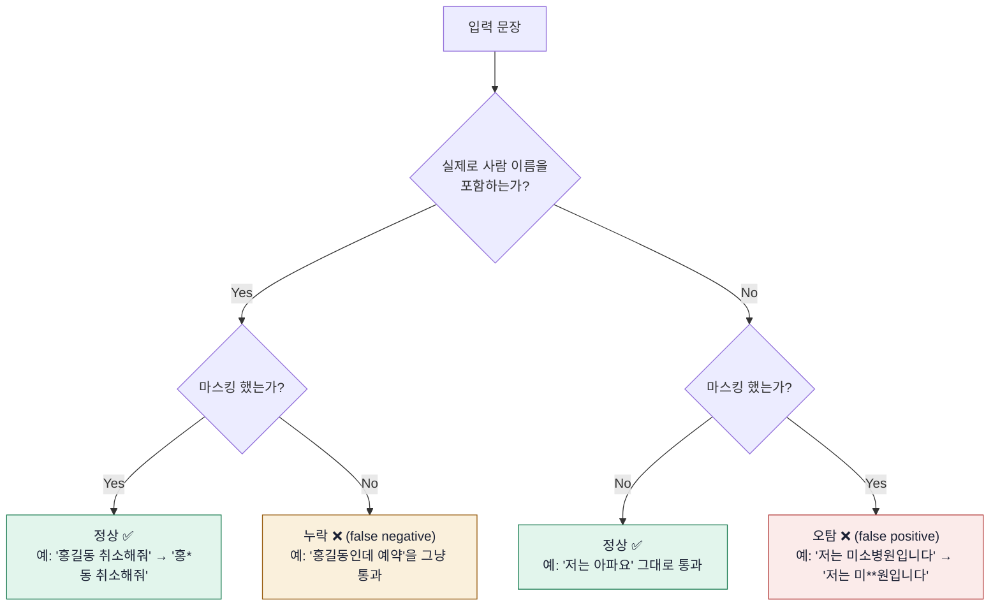
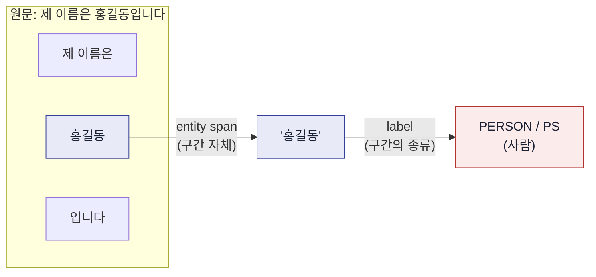
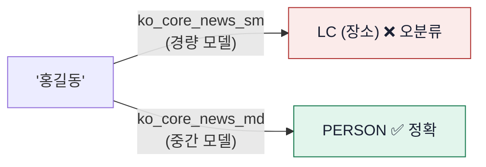
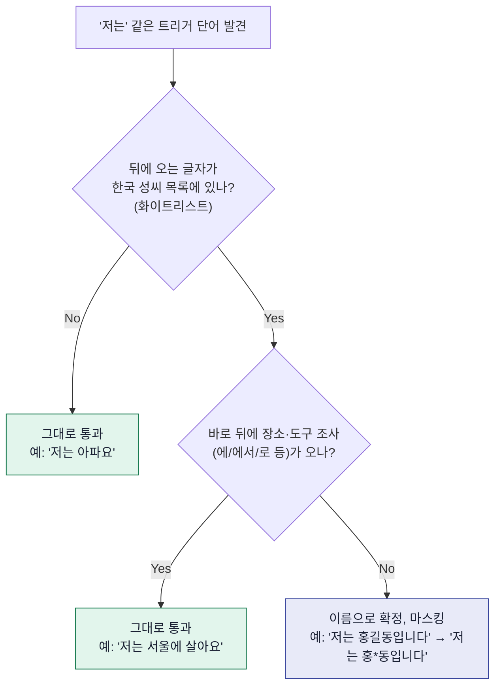
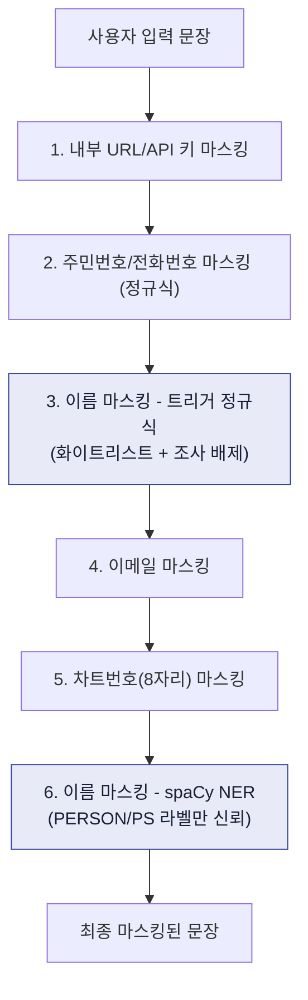
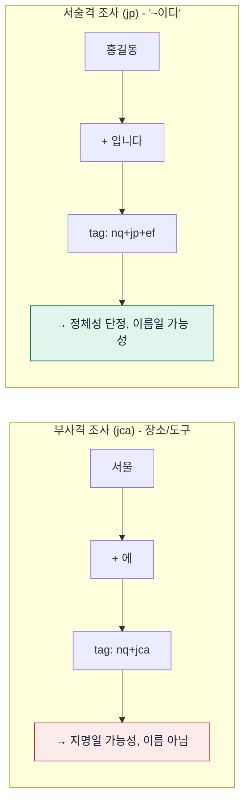
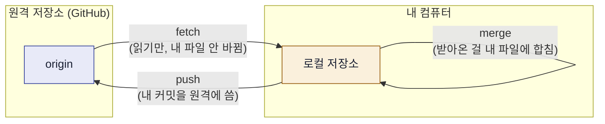

# chatbot.md 용어 설명서

`chatbot.md`(2026-09-14 PII 마스킹 수정)를 읽을 때 나오는 용어를 그림과 함께 정리했습니다.
GitHub이나 VS Code(Markdown Preview)에서 열면 아래 도표가 그대로 그려집니다.

---

## 1. 오탐 vs 누락 - 전체 그림

"이름 마스킹"이 저지를 수 있는 실수는 두 가지뿐입니다: **오탐**(아닌데 마스킹함)과 **누락**(맞는데 안 함).



**정밀도(Precision)**는 "마스킹한 것 중 진짜 이름 비율"(오탐이 적을수록 높음), **재현율(Recall)**은
"진짜 이름 중 실제로 마스킹한 비율"(누락이 적을수록 높음)입니다. 이번 작업에서 `ko_core_news_md`로
바꾸면서 정밀도는 올라갔지만("강남역"을 더 이상 안 잡음), 재현율은 살짝 내려갔습니다
("홍길동인데"류를 일부 놓침) — 하나를 올리면 다른 하나가 내려가는 트레이드오프 관계입니다.

---

## 2. NER: 엔티티(entity)와 라벨(label)의 차이

spaCy의 NER(개체명 인식)은 문장에서 두 가지를 합니다: **어디부터 어디까지**(엔티티) + **그게 뭔지**(라벨).



문제는 라벨을 항상 정확히 매기지 못한다는 것이었습니다. 작은 모델(`sm`)은 "홍길동"을 `PERSON`이
아니라 `LC`(Location, 장소)로 잘못 매겼습니다. 그래서 한동안 라벨을 안 믿고 성씨 패턴으로
우회했다가, 더 큰 모델(`md`)로 바꾸니 라벨이 정확해져서 다시 라벨을 믿는 방식으로 되돌렸습니다.



---

## 3. 정규식 트리거 + lookahead는 어떻게 판단하는가

`pii_masking.py`의 "저는/나는 + N글자" 정규식은 spaCy 없이 순수 문자열 규칙만으로 이름을
찾습니다. 판단 순서는 이렇습니다.



**lookahead(전방탐색)**란 정규식에서 "그 글자를 실제로 소비(제거)하지 않고, 뒤에 이런 게
있는지만 몰래 훔쳐보는" 문법(`(?=...)`)입니다. 그래서 "홍길동**입니다**"에서 "입니다"는
확인만 하고 마스킹 결과에는 안 남습니다 → `홍*동입니다`.

---

## 4. `mask_pii()` 전체 처리 흐름



3번과 6번이 이번에 고친 부분입니다. 3번은 트리거가 있을 때(spaCy 없이), 6번은 트리거가
없을 때(spaCy로) 이름을 잡습니다.

---

## 5. 한국어 조사 구분 - `jca` vs `jp`

spaCy가 형태소를 분석하면 조사의 "종류"까지 태그로 알려줍니다. 이 차이가 "지명"과
"이름"을 구분하는 실마리가 됩니다.



---

## 6. Git: fetch / merge / push의 차이



이번 작업에서 `git fetch`는 여러 번 했지만(원격 상태만 확인), `merge`/`push`는 항상 먼저
설명하고 승인받은 뒤에만 실행했습니다 — 공용 저장소라 팀원 작업을 덮어쓸 위험이 있기 때문입니다.

---

## 7. 조상 커밋(ancestor)이 왜 중요한가

A 커밋이 B 커밋의 "예전 버전"에 해당하면 A는 B의 **조상**입니다. 조상 관계면 병합할 때
충돌이 안 납니다 - 그냥 이어붙이면 되기 때문입니다.

```mermaid
gitGraph
    commit id: "abc517d (내 로컬 HEAD)"
    commit id: "769112d"
    commit id: "a5ff49f"
    branch main
    commit id: "b1134c3 (feature/ocr 병합)"
    commit id: "289c994 (대시보드 기능)"
    commit id: "060f4e1 (로그인 탐지 추가)"
```

`abc517d`(내 로컬 HEAD)가 `main`의 맨 위(`060f4e1`)보다 앞서 있지만, 그 히스토리 안에
포함돼 있으므로 "조상"입니다. 그래서 `chatbot` 브랜치를 origin/main 최신 지점에서 새로
만들어도 제가 고친 `pii_masking.py` 내용이 충돌 없이 그대로 얹혔습니다.

---

## 8. 용어 사전

### NLP(자연어처리)

| 용어 | 뜻 |
|---|---|
| NER (개체명 인식) | 문장에서 사람/장소/기관 같은 "개체"를 자동으로 찾아내는 기술 |
| spaCy | NER 등 언어 분석을 해주는 오픈소스 파이썬 라이브러리 |
| ko_core_news_sm / md | spaCy의 한국어 모델. sm(경량)·md(중간 크기), 클수록 정확하지만 무거움 |
| 엔티티(entity) | NER이 찾아낸 텍스트 구간 자체 |
| 라벨(label) | 그 엔티티가 무슨 종류인지 매긴 값 (PERSON=사람, LC=장소, OG=기관) |
| 오탐 (false positive) | 아닌데 맞다고 잘못 판단 |
| 누락/미탐 (false negative) | 맞는데 놓침 |
| 정밀도(Precision) / 재현율(Recall) | 오탐이 적을수록 정밀도↑, 누락이 적을수록 재현율↑ (트레이드오프) |

### 정규식 / 코드

| 용어 | 뜻 |
|---|---|
| 정규식 (Regex) | 문자열에서 패턴을 찾는 규칙 문법 |
| 트리거(trigger) | "이 다음에 이름이 나올 것 같다"는 신호 단어 (예: "저는") |
| lookahead (전방탐색) | 실제로 소비하지 않고 뒤에 패턴이 있는지만 확인하는 정규식 기법 `(?=...)` |
| 화이트리스트(whitelist) | 미리 정해둔 허용 목록에 있는 것만 통과시키는 방식 |
| 블랙박스 호출 | 내부 구현을 몰라도 결과만 갖다 쓰는 방식 |

### 한국어 문법 (spaCy 형태소 태그)

| 용어 | 뜻 |
|---|---|
| 조사(particle) | "은/는/이/가/에/로" 등 명사 뒤에 붙는 문법 요소 |
| 부사격 조사 (`jca`) | 장소·도구·방향을 나타내는 조사 (예: "서울**에**") |
| 서술격 조사 (`jp`) | "~이다"를 나타내는 조사 (예: "홍길동**입니다**") |

### 파이썬 환경

| 용어 | 뜻 |
|---|---|
| venv (가상환경) | 프로젝트마다 패키지를 따로 설치해 격리하는 폴더 |
| PEP 668 / externally-managed-environment | 시스템 파이썬을 함부로 건드리지 못하게 막는 보호 정책 |
| `--break-system-packages` | 위 보호를 강제로 우회하는 pip 옵션 |

### Git

| 용어 | 뜻 |
|---|---|
| fetch | 원격 저장소 정보만 받아오고 내 파일은 안 바꾸는 것 (조회) |
| merge / push | 실제로 내 파일이나 원격 저장소 내용을 바꾸는 것 |
| 조상 커밋(ancestor) | 한 커밋이 다른 커밋의 이전 이력에 포함되는 관계 (충돌 없이 합쳐짐) |
| PR (Pull Request) | "이 브랜치를 main에 merge해도 될지 봐주세요" 하는 리뷰 요청 |
